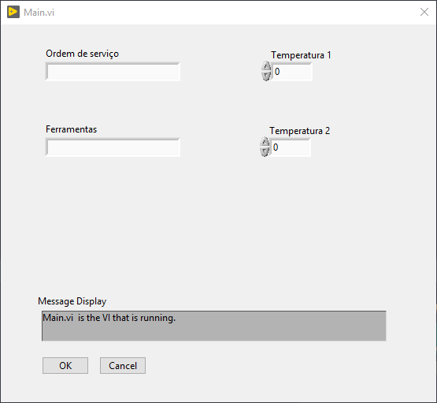
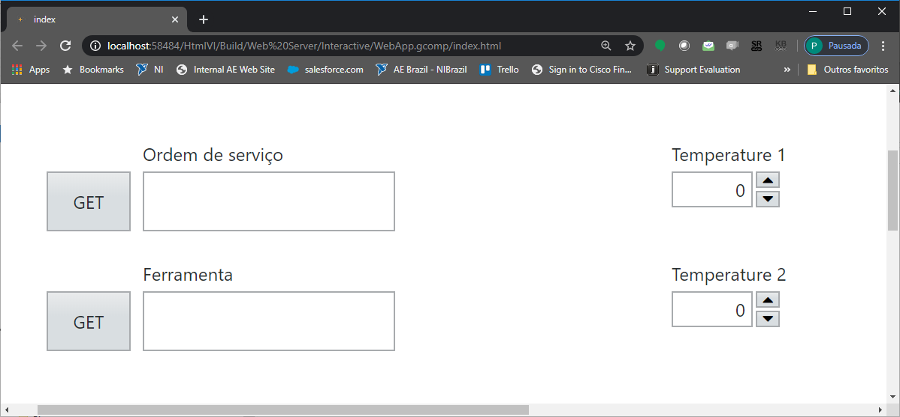

# IoT_MES_MVP

This project was a PoC to show a integration of a WebVI to a simple MES. The idea is to have a copy of the MES interface in portable device, so operator can entry and query data either in the station or in a tablet when he communting or near to some production machine/station.

## Station MES Front Panel

## Portable MES Front Panel

